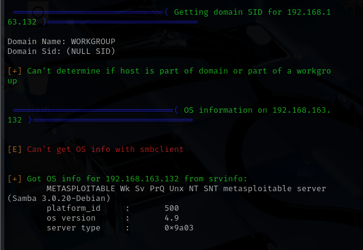
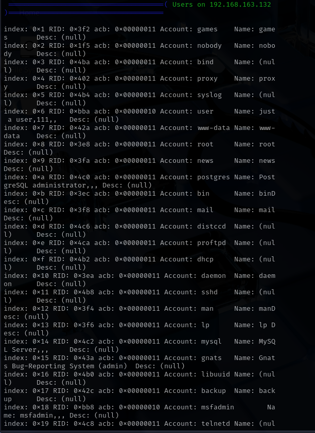
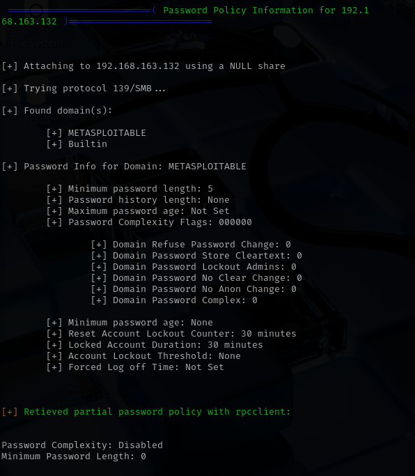
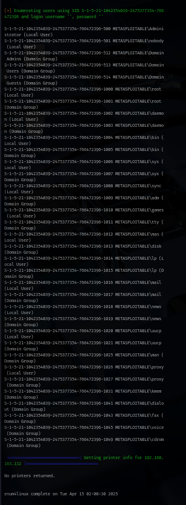

# Lab 1: Cryptographic Attacks
**Student Name:** Haziq  
**Username@Hostname:** Haziq@NWS0020  
**Tools Used:** Hydra, Burp Suite, Wireshark, etc.

---

## Table of Contents
- [1. Enumeration](#1-enumeration)
- [2. Brute Force Attacks](#2-brute-force-attacks)
- [3. Traffic Analysis](#3-traffic-analysis)
- [4. Problems Encountered](#4-problems-encountered)
- [5. Mitigation Strategies](#5-mitigation-strategies)
- [6. Screenshots & Evidence](#6-screenshots--evidence)

---

## 1. Enumeration 

> before we begin i should clarify what enemuration means in simple terms. Enumeration is the process of listing or naming items individually, one by one. It's a way of organizing and presenting a collection of items in a structured way. An example of an enumeration list is "apple, banana, orange"

### Objective:
Identify potential usernames on the Metasploitable 2 VM to use in brute force attacks.

First we need to identify open ports and services that are available and running on the target VM :
    nmap -sC -sV -p 21, 22, 23, 80 [Target_IP]

Explanation for above command:

    - `-C`: Runs a default NSE scripts
    - `-sV`: Detect which service version is available
    - `-p`: Scans the ports that are requested (exp: FTP=21)

  

### Enumerating Usernames

### From SMB (to use with SSH, Telnet, FTP down the line): 
    enum4linux -a [TARGET_IP]

What the command does :
Enumerates users, shares, groups, and policies over SMB. Useful for finding valid system usernames that might also exist in SSH/Telnet/FTP. It can look for usernames like `msfadmin (metasploitable 2)`, `user` , `admin` etc etc

### Web Server Enumeration (HTTP)
We're using `gobuster` to find hidden directories or files on the web server:
    gobuster dir -u http://[TARGET_IP] -w /usr/share/wordlists/dirb common.txt

Command explanation:
    - `-u`: URL we're targeting
    - `-w`: Wordlist 
    - `-t`: Number of thread and we can also adjust the speed 

---

## 2. Brute Force Attacks

### Objective:
Perform brute force login attempts using Hydra and Burp Suite to crack service credentials.

### Preparation
Before launching brute force attacks, make sure you have:

- A list of usernames (`userlist.txt`)
- A list of passwords (`passwordlist.txt`)
  
Using default one from kali could work but the existing file contain a huge amount of password so it'll take a long time to crack them one by one. So we'll create a short one of our own:

    echo -e "admin\nmsfadmin\nrahsia\nuser\ncuba" > userlist.txt
    echo -e "12345\nmsfadmin\nftp1234\nadmin\npassword" > passwordlist.txt

### 2.1 Brute force attack using Hydra
    hydra -L userlist.txt -P passwordlist.txt [Target_IP] ftp -V

-  `-L userlist.txt`: path to username list
-  `-P passwordlist.txt`: path to password list
-  `-V`: verbose (shows attempts)
-  `ftp://[Target_IP]`: targets ftp service

  
### 2.2 TELNET Brute force attack using Hydra
    hydra -L userlist.txt -P passwordlist.txt [Target_IP] telnet -V

-  `-L userlist.txt`: path to username list
-  `-P passwordlist.txt`: path to password list
-  `-V`: verbose (shows attempts)
-  `telnet://[Target_IP]`: targets telnet service

### 2.3 SSH Brute force attack using NetExec

We're using NetExec for SSH
    nxc ssh [Target_IP] -u userlist.txt -p passwordlist.txt
    nxc ssh [TARGET_IP] -u userlist.txt -p passlist.txt -m ssh

-  `-u userlist.txt`: path to username list
-  `-p passwordlist.txt`: path to password list
-  `-m ssh`: specifies SSH as the target service
  
### 2.4 HTTP Login Brute Force Attack using Burp Suite

1. Launch Burp’s Browser:

   - Go to Proxy > Intercept tab.
   - Make sure the Intercept is ON.
   - Click "Open Browser" — this opens Burp's built-in browser (already configured to route traffic through Burp).
   - Arrange your windows so you can see both Burp and the browser.

2. Intercept a Request

   - In Burp's browser, navigate to the target login page (e.g., http://[target-ip]/login).
   - Try to submit the login form (enter any dummy credentials).
   - Burp will intercept the HTTP request.
   - You’ll see the full request in Proxy > Intercept tab.

3. Forward the Request
    
   - Click "Forward" to allow the request to continue to the server.
   - If multiple requests are intercepted, keep clicking Forward until the page loads.
   - This is useful if you want to watch exactly how the form is submitted.

4. Turn Off Intercept
   
   - Go back to the Proxy > Intercept tab.
   - Toggle "Intercept is OFF" to let future requests pass through automatically.
   - This prevents Burp from pausing the browser every time a request is made.

5. View HTTP History
   - Go to Proxy > HTTP history.
   - Scroll to find the POST request to the login page.
   - Click it to view the raw request and response.
   - Right-click the request → Send to Intruder.

6. In Intruder tab:
   - Set attack type to Cluster Bomb
   - Mark username and password fields as payload - positions

7. Load payloads:
   - Payload set 1: `userlist.txt`
   - Payload set 2: `passwordlist.txt`

8.  Start Attack and watch for:
    - Status code changes
    - Different length in response
    - Success indicators (e.g., “Welcome” or redirect)

---

## 3. Traffic Analysis

1. Open Wireshark:
   sudo wireshark

2. Start capture on the network interface connected to the target.
3. Apply filters:
   - FTP: `tcp.port == 21`
   - TELNET: `tcp.port == 23`
   - SSH: `tcp.port == 22`
   - HTTP: `tcp.port == 80`
4. Identify unencrypted traffic containing credentials.

### Capturing Packets using tcpdump
    sudo tcpdump -i eth0 port 21 or port 23 or port 22 or port 80 -w capture.pcap

Analyse `capture.pcap` in Wireshark